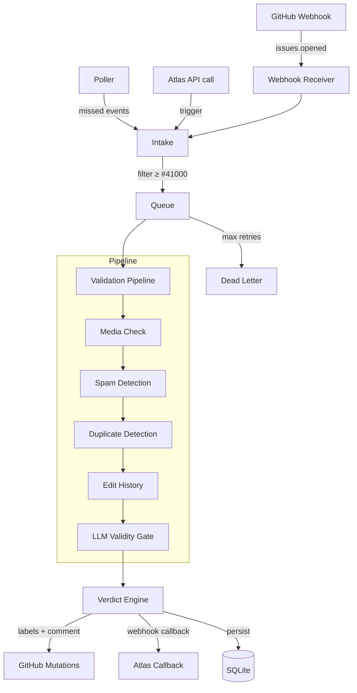

# Bounty-bot

Automated GitHub bounty issue validation service. Bounty-bot receives GitHub webhook events (or polls for missed issues), runs every submission through a multi-stage detection pipeline — media checks, spam analysis, duplicate detection, edit-history fraud, and LLM-assisted scoring — then publishes a verdict back to GitHub with labels, comments, and issue state changes.

Controlled by **Atlas** via a REST API with HMAC authentication. Callbacks are sent to Atlas on completion or failure.

## Architecture



## Quick Start

### Prerequisites

| Dependency | Version |
|---|---|
| Node.js | ≥ 20 |
| Redis | any (default port 3231) |
| Docker + Compose | optional, for containerised deployment |

### Environment Variables

Create a `.env` file (see [Configuration](#configuration) for the full list):

```env
GITHUB_TOKEN=ghp_...
GITHUB_WEBHOOK_SECRET=your-webhook-secret
INTER_SERVICE_HMAC_SECRET=shared-secret-with-atlas
REDIS_URL=redis://localhost:3231
OPENROUTER_API_KEY=sk-or-...
ATLAS_WEBHOOK_URL=http://localhost:3230/webhooks
TARGET_REPO=PlatformNetwork/bounty-challenge
```

### Docker Compose

```bash
docker compose up -d
```

The service starts on **port 3235** with SQLite data persisted in a Docker volume.

### Development Mode

```bash
npm install
npm run dev          # tsx hot-reload on src/index.ts
npm run build        # compile TypeScript
npm start            # run compiled output
```

## API Reference

All `/api/v1/*` endpoints (except webhooks) require HMAC authentication via `X-Signature` and `X-Timestamp` headers.

| Method | Endpoint | Auth | Description |
|---|---|---|---|
| `POST` | `/api/v1/validation/trigger` | HMAC | Trigger validation for an issue |
| `GET` | `/api/v1/validation/:issue_number/status` | HMAC | Get processing status and verdict |
| `POST` | `/api/v1/validation/:issue_number/requeue` | HMAC | Requeue for re-validation (24 h max, once per issue) |
| `POST` | `/api/v1/validation/:issue_number/force-release` | HMAC | Clear a stale processing lock |
| `GET` | `/api/v1/dead-letter` | HMAC | List dead-lettered items |
| `POST` | `/api/v1/dead-letter/:id/recover` | HMAC | Re-enqueue a dead-letter item |
| `POST` | `/api/v1/webhooks/github` | GitHub signature | Receive GitHub webhook events |
| `GET` | `/health` | none | Liveness probe |
| `GET` | `/ready` | none | Readiness probe |

See [docs/API.md](docs/API.md) for full request/response schemas.

## Configuration

| Variable | Default | Description |
|---|---|---|
| `PORT` | `3235` | API listen port |
| `DATA_DIR` | `./data` | SQLite data directory |
| `SQLITE_PATH` | `<DATA_DIR>/bounty-bot.db` | Database file path |
| `REDIS_URL` | `redis://localhost:3231` | Redis connection URL |
| `GITHUB_TOKEN` | — | GitHub PAT for API requests |
| `GITHUB_WEBHOOK_SECRET` | — | Secret for verifying GitHub webhook signatures |
| `INTER_SERVICE_HMAC_SECRET` | — | Shared HMAC secret for Atlas ↔ bounty-bot auth |
| `ATLAS_WEBHOOK_URL` | `http://localhost:3230/webhooks` | Atlas callback endpoint |
| `TARGET_REPO` | `PlatformNetwork/bounty-challenge` | GitHub repo to validate (owner/repo) |
| `OPENROUTER_API_KEY` | — | OpenRouter key for LLM scoring and embeddings |
| `OPENROUTER_BASE_URL` | `https://openrouter.ai/api/v1` | OpenRouter API base URL |
| `EMBEDDING_MODEL` | `qwen/qwen3-embedding-8b` | Model for semantic embeddings |
| `LLM_SCORING_MODEL` | `google/gemini-3.1-pro-preview-customtools` | Model for issue evaluation |
| `POLLER_INTERVAL` | `60000` | Missed-webhook poller interval (ms) |
| `MAX_RETRIES` | `3` | Queue retry limit before dead-lettering |
| `ISSUE_FLOOR` | `41000` | Minimum issue number to process |
| `SPAM_THRESHOLD` | `0.7` | Spam score threshold (0–1) |
| `DUPLICATE_THRESHOLD` | `0.75` | Duplicate similarity threshold (0–1) |
| `REQUEUE_MAX_AGE_MS` | `86400000` | Max issue age for requeue eligibility (24 h) |
| `WEBHOOK_MAX_RETRIES` | `3` | Atlas callback retry attempts |
| `WEBHOOK_RETRY_DELAY_MS` | `1000` | Base delay between callback retries (ms) |

## LLM Integration

Bounty-bot uses two AI models via [OpenRouter](https://openrouter.ai) (OpenAI-compatible API):

### Gemini 3.1 Pro Custom Tools — Issue Evaluation

Model: `google/gemini-3.1-pro-preview-customtools`

Used for full issue evaluation and borderline spam scoring. The model receives a system prompt describing the evaluation criteria and is forced to call a `deliver_verdict` function via OpenAI-style tool/function calling. Returns a structured verdict (`valid` / `invalid` / `duplicate`), confidence score, reasoning, and a public-facing recap.

### Qwen3 Embedding 8B — Semantic Duplicate Detection

Model: `qwen/qwen3-embedding-8b`

Generates high-dimensional embedding vectors for issue text. These vectors are stored in SQLite and compared via cosine similarity to detect semantic duplicates that lexical fingerprinting might miss. The final duplicate score is a hybrid: `0.4 × Jaccard + 0.6 × cosine`.

Both models gracefully degrade: if `OPENROUTER_API_KEY` is unset, the system falls back to lexical-only detection and skips LLM scoring.

## Testing

```bash
npm test             # run all 149 tests (vitest)
npm run typecheck    # TypeScript type checking
npm run lint         # ESLint
```

## Further Documentation

- [Architecture](docs/ARCHITECTURE.md) — system design, module graph, sequence diagrams, database schema
- [API Reference](docs/API.md) — full REST API with request/response schemas
- [Detection Engine](docs/DETECTION.md) — spam, duplicate, edit-history, and LLM scoring details
- [Deployment](docs/DEPLOYMENT.md) — Docker, Redis, health checks, Atlas integration
