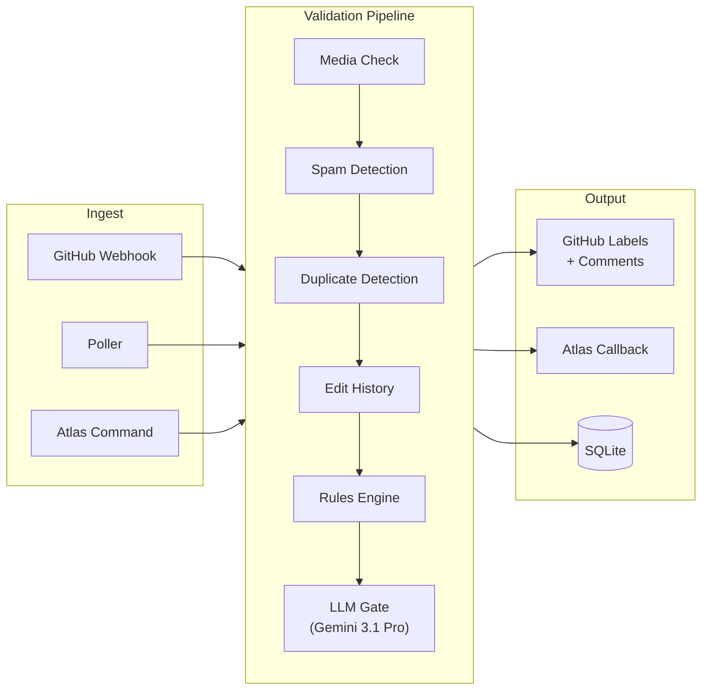

<div align="center">

# Bounty Bot

**Autonomous GitHub issue validation engine for bug bounty programs**

**<a href="docs/ARCHITECTURE.md">Architecture</a> · <a href="docs/API.md">API</a> · <a href="docs/DETECTION.md">Detection</a> · <a href="docs/RULES.md">Rules</a> · <a href="docs/DEPLOYMENT.md">Deployment</a> · <a href="docs/CONFIGURATION.md">Configuration</a>**

[](https://github.com/PlatformNetwork/bounty-bot/actions/workflows/ci.yml)


</div>

---

## Overview

Bounty Bot is the validation backbone for PlatformNetwork's bug bounty program. Every issue submitted to [bounty-challenge](https://github.com/PlatformNetwork/bounty-challenge) is automatically ingested, scored through a multi-stage detection pipeline, and labeled with a verdict — all without human intervention.

**Core principles**
- LLM-assisted evaluation with deterministic rule enforcement.
- Zero-trust design: HMAC-signed inter-service calls, no hardcoded secrets.
- Extensible rules engine — drop a `.ts` file in `rules/` and it's live.

---

## How It Works



Each issue passes through six stages. A failure at any stage short-circuits to a verdict:

| Stage | What it checks | Failure verdict |
|---|---|---|
| **Media** | Screenshot/video present and accessible (HTTP 200) | `invalid` |
| **Spam** | Template similarity, burst frequency, parity scoring | `invalid` |
| **Duplicate** | Jaccard + Qwen3 cosine hybrid (`0.4J + 0.6C`) | `duplicate` |
| **Edit History** | Suspicious post-submission edits (evidence swaps) | `invalid` |
| **Rules** | Configurable rules from `rules/*.ts` | `invalid` or penalty |
| **LLM Gate** | Gemini 3.1 Pro with `deliver_verdict` tool calling | `invalid` |

If all stages pass, the issue is labeled **valid**.

---

## Quick Start

```bash
git clone https://github.com/PlatformNetwork/bounty-bot.git
cd bounty-bot
cp .env.example .env   # fill in your tokens
npm install
npm run dev
```

Or with Docker:

```bash
docker compose up -d   # starts bounty-bot + Redis + Watchtower
```

The API listens on **port 3235**. Watchtower auto-updates from GHCR every 60 seconds.

---

## API

All `/api/v1/*` endpoints require HMAC authentication (`X-Signature` + `X-Timestamp`).

| Method | Endpoint | Description |
|---|---|---|
| `POST` | `/api/v1/validation/trigger` | Trigger validation |
| `GET` | `/api/v1/validation/:issue/status` | Get verdict status |
| `POST` | `/api/v1/validation/:issue/requeue` | Re-validate (24h window) |
| `POST` | `/api/v1/validation/:issue/force-release` | Clear stale lock |
| `GET` | `/api/v1/rules` | List loaded rules |
| `POST` | `/api/v1/rules/reload` | Hot-reload rules from disk |
| `GET` | `/health` | Liveness probe |

Full schemas and examples: **<a href="docs/API.md">docs/API.md</a>**

---

## Rules Engine

Drop a TypeScript file in `rules/` and bounty-bot loads it at startup. Each file exports an array of typed rules that are evaluated during the pipeline and injected into the LLM prompt.

```
rules/
  validity.ts     # body length, title quality, structure
  media.ts        # evidence requirements
  spam.ts         # template detection, generic titles
  content.ts      # profanity, length limits, context
  scoring.ts      # penalty weight adjustments
```

Four severity levels:

| Severity | Effect |
|---|---|
| `reject` | Instant `invalid` verdict |
| `require` | Must pass or `invalid` |
| `penalize` | Adds weight to penalty score |
| `flag` | Logged but no verdict change |

Hot-reload without restart: `POST /api/v1/rules/reload`

Full documentation: **<a href="docs/RULES.md">docs/RULES.md</a>**

---

## LLM Integration

Two models via [OpenRouter](https://openrouter.ai) — both degrade gracefully if no API key is set.

| Model | Purpose | Used in |
|---|---|---|
| `google/gemini-3.1-pro-preview-customtools` | Issue evaluation with function calling | `deliver_verdict` tool |
| `qwen/qwen3-embedding-8b` | Semantic duplicate detection | Cosine similarity vectors |

The LLM receives pre-computed detection scores **and** rule evaluation results in its prompt, so rules directly influence the model's reasoning.

---

## Testing

```bash
npm test             # 149 tests (vitest)
npm run typecheck    # tsc --noEmit
npm run lint         # eslint
```

---

## Documentation

| Document | Description |
|---|---|
| **<a href="docs/ARCHITECTURE.md">Architecture</a>** | System design, module graph, sequence diagrams, database schema |
| **<a href="docs/API.md">API Reference</a>** | Full REST API with request/response schemas |
| **<a href="docs/DETECTION.md">Detection Engine</a>** | Spam, duplicate, edit-history, and LLM scoring internals |
| **<a href="docs/RULES.md">Rules Engine</a>** | How to write, load, and manage validation rules |
| **<a href="docs/CONFIGURATION.md">Configuration</a>** | All environment variables and their defaults |
| **<a href="docs/DEPLOYMENT.md">Deployment</a>** | Docker, Redis, Watchtower, Atlas integration |

---

<div align="center">

Controlled by **<a href="https://github.com/PlatformNetwork/atlas">Atlas</a>** · Part of **<a href="https://github.com/PlatformNetwork">PlatformNetwork</a>**

</div>
