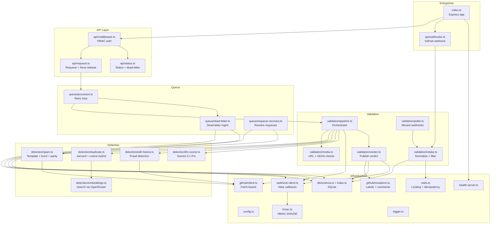
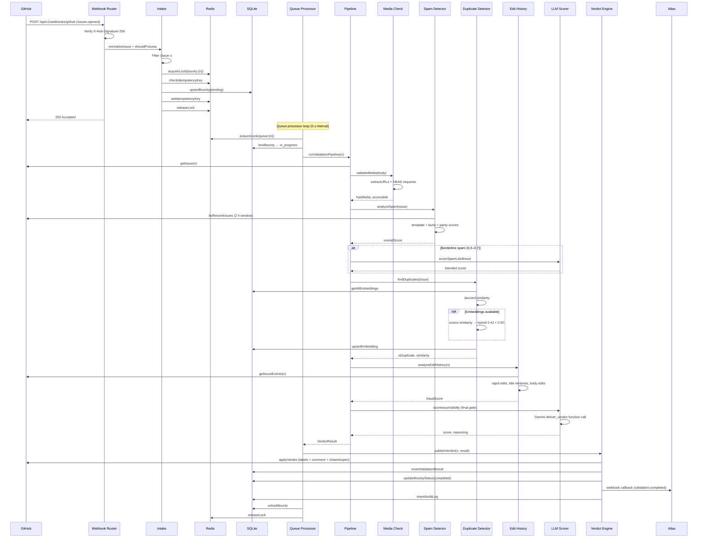

# Architecture

## Module Graph

## Sequence Diagram — Webhook to Verdict

## Database Schema

Bounty-bot uses **SQLite** (via `better-sqlite3`) with 8 tables:

### bounties

Primary tracking table — one row per GitHub issue under validation.

| Column | Type | Notes |
|---|---|---|
| `issue_number` | INTEGER PK | GitHub issue number |
| `workspace_id` | TEXT UNIQUE | External workspace reference |
| `repo` | TEXT | owner/repo |
| `title` | TEXT | Issue title |
| `body` | TEXT | Issue body |
| `author` | TEXT | GitHub login |
| `created_at` | TEXT | ISO timestamp |
| `status` | TEXT | `pending` → `in_progress` → `completed` / `dead_lettered` |
| `verdict` | TEXT | `valid` / `invalid` / `duplicate` |
| `labels` | TEXT | Comma-separated label names |
| `locked_by` | TEXT | Lock owner identifier |
| `locked_at` | TEXT | Lock acquisition time |
| `lock_expires_at` | TEXT | Lock expiry time |
| `retry_count` | INTEGER | Current retry attempt |
| `max_retries` | INTEGER | Configured max (default 3) |
| `updated_at` | TEXT | Last modification |

### validation_results

Verdicts produced by the validation pipeline.

| Column | Type | Notes |
|---|---|---|
| `id` | INTEGER PK | Auto-increment |
| `issue_number` | INTEGER FK | → bounties |
| `workspace_id` | TEXT | |
| `verdict` | TEXT | `valid` / `invalid` / `duplicate` |
| `rationale` | TEXT | Human-readable explanation |
| `evidence` | TEXT | JSON blob |
| `spam_score` | REAL | 0–1 |
| `duplicate_of` | INTEGER | Original issue number |
| `media_check` | TEXT | JSON blob |
| `created_at` | TEXT | |

### spam_analysis

Per-issue spam scoring breakdown.

| Column | Type | Notes |
|---|---|---|
| `id` | INTEGER PK | |
| `issue_number` | INTEGER | |
| `template_score` | REAL | Jaccard similarity to author's recent issues |
| `burst_score` | REAL | Submission frequency score |
| `parity_score` | REAL | Content quality score |
| `overall_score` | REAL | Weighted combination |
| `details` | TEXT | Human-readable breakdown |
| `created_at` | TEXT | |

### embeddings

Vector fingerprints for duplicate detection.

| Column | Type | Notes |
|---|---|---|
| `id` | INTEGER PK | |
| `issue_number` | INTEGER UNIQUE | |
| `title_fingerprint` | TEXT | SHA-256 of title n-grams |
| `body_fingerprint` | TEXT | Combined title+body text |
| `embedding_vector` | BLOB | JSON-encoded float array (Qwen3) |
| `created_at` | TEXT | |

### requeue_records

Manual or automated re-validation requests.

| Column | Type | Notes |
|---|---|---|
| `id` | INTEGER PK | |
| `issue_number` | INTEGER FK | → bounties |
| `requester_id` | TEXT | Who requested the requeue |
| `requester_context` | TEXT | JSON context |
| `status` | TEXT | `pending` → `completed` |
| `requeued_at` | TEXT | |
| `completed_at` | TEXT | |
| `callback_sent` | INTEGER | 0/1 |

### dead_letter

Bounties that exhausted all retry attempts.

| Column | Type | Notes |
|---|---|---|
| `id` | INTEGER PK | |
| `bounty_id` | INTEGER | Issue number |
| `failure_cause` | TEXT | Error message |
| `last_attempt` | TEXT | |
| `metadata` | TEXT | JSON blob |
| `retry_count` | INTEGER | |
| `created_at` | TEXT | |

### delivery_log

Digest delivery de-duplication (workspace + window).

### audit_log

Immutable action trail — every verdict, requeue, dead-letter, and force-release is logged.

| Column | Type | Notes |
|---|---|---|
| `id` | INTEGER PK | |
| `workspace_id` | TEXT | |
| `action` | TEXT | e.g. `verdict.valid`, `bounty.requeued` |
| `actor` | TEXT | `bounty-bot`, requester ID, or `system` |
| `details` | TEXT | JSON blob |
| `github_ref` | TEXT | e.g. `#41234` |
| `discord_ref` | TEXT | |
| `created_at` | TEXT | |

## Queue System

Bounty-bot uses an **in-memory queue** backed by Redis distributed locking and SQLite persistence:

1. **Intake** normalises and filters the issue, acquires a Redis lock, checks idempotency, and upserts into `bounties` with status `pending`.
2. **Queue Processor** runs on a 5-second interval. It shifts an entry from the in-memory queue, acquires a Redis lock (`lock:queue:{n}`), locks the bounty row in SQLite, and runs the full validation pipeline.
3. **Retries** — on pipeline failure, the entry is re-enqueued with an incremented `retryCount`. After `MAX_RETRIES` (default 3), the issue moves to the **dead-letter** queue.
4. **Dead Letter** — inserts into the `dead_letter` table, updates bounty status to `dead_lettered`, sends a `validation.failed` webhook to Atlas, and logs to the audit trail. Dead-lettered items can be manually recovered via the REST API.
5. **Requeue Recovery** — a 30-second interval scheduler checks pending requeue records. When the underlying bounty reaches a terminal status (`completed` or `dead_lettered`), it marks the requeue record as completed and sends a `validation.completed` callback to Atlas.
6. **Poller** — runs on a configurable interval (default 60 s) to catch issues that were opened while the webhook endpoint was unreachable. Fetches recent issues from the GitHub API and passes them through the intake pipeline.
