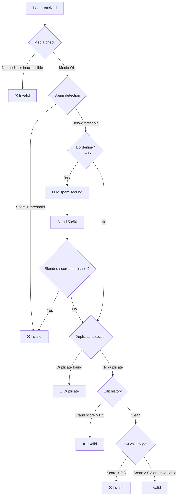

# Detection Engine

The validation pipeline runs five detection stages in sequence. The first failing check determines the verdict.



**Verdict priority:** Media → Spam → Duplicate → Edit fraud → LLM validity → Valid

---

## 1. Media Validation

**File:** `src/validation/media.ts`

Extracts media URLs from the issue body and checks accessibility.

### URL Extraction

Five regex patterns are used to find media URLs:

| Pattern | Matches |
|---|---|
| Markdown images | `` |
| HTML img tags | `` |
| Direct media URLs | `.png`, `.jpg`, `.gif`, `.mp4`, `.webm`, etc. |
| GitHub assets | `user-images.githubusercontent.com`, `github.com/.../assets/` |
| Video platforms | YouTube, Vimeo links |

### Accessibility Check

Each extracted URL is verified with a `HEAD` request (5-second timeout, follows redirects). An issue is flagged as **invalid** if:
- No media URLs are found in the body, **or**
- All found media URLs are inaccessible

---

## 2. Spam Detection

**File:** `src/detection/spam.ts`

Combines three scoring components into a weighted overall score.

### Template Score (weight: 0.4)

Compares the issue's word set against the same author's recent issues (within a 2-hour window) using **Jaccard similarity** on lowercase word sets.

```
Jaccard(A, B) = |A ∩ B| / |A ∪ B|
```

High similarity to recent issues from the same author indicates template-based farming.

### Burst Score (weight: 0.3)

Counts issues from the same author in the last 2 hours:

| Author issues in 2 h | Score |
|---|---|
| ≤ 1 | 0.0 |
| 2 | 0.25 |
| 3 | 0.50 |
| 5+ | 1.0 |

Formula: `min(1, (count - 1) × 0.25)`

### Parity Score (weight: 0.3)

Content quality indicators:

| Indicator | Score |
|---|---|
| Body < 50 chars | +0.4 |
| Body < 100 chars | +0.2 |
| Template-like title (`Bug Report #N`, `Test #N`, etc.) | +0.3 |
| Title ≈ body (body starts with title) | +0.2 |
| No line breaks in body > 50 chars | +0.1 |

### Overall Score

```
overall = 0.4 × template + 0.3 × burst + 0.3 × parity
```

Issues with `overall ≥ SPAM_THRESHOLD` (default **0.7**) are flagged as spam.

### LLM Blending (borderline cases)

When the spam score is between **0.3 and 0.7**, the pipeline consults the LLM for a second opinion. The final score is a 50/50 blend:

```
blended = 0.5 × heuristic_score + 0.5 × llm_score
```

---

## 3. Duplicate Detection

**File:** `src/detection/duplicate.ts`

Uses a hybrid approach combining lexical fingerprinting and semantic embeddings.

### Lexical Fingerprinting

1. **Normalize** text: lowercase, remove punctuation, remove stop words
2. Generate **2-grams and 3-grams** from the word list
3. Hash the sorted n-gram set with SHA-256 to produce a deterministic fingerprint

### Jaccard Similarity

Word-level Jaccard similarity between the candidate issue and each stored issue:

```
Jaccard(A, B) = |A ∩ B| / |A ∪ B|
```

Computed on normalised word sets (after stop-word removal).

### Semantic Embeddings (Qwen3)

When `OPENROUTER_API_KEY` is configured, the system computes a high-dimensional embedding vector using **Qwen3 Embedding 8B** via the OpenRouter API. Vectors are stored as JSON-encoded BLOBs in the `embeddings` table.

**Cosine similarity** between embedding vectors:

```
cosine(A, B) = (A · B) / (‖A‖ × ‖B‖)
```

### Hybrid Score

When both lexical and semantic scores are available:

```
hybrid = 0.4 × Jaccard + 0.6 × cosine
```

When embeddings are unavailable, the system falls back to Jaccard-only.

### Older-Issue-Only Rule

Only issues with a **lower issue number** can be the "original". This prevents newer issues from retroactively marking older ones as duplicates.

Issues below `ISSUE_FLOOR` (default 41000) are excluded from comparison.

### Threshold

Issues with `hybrid ≥ DUPLICATE_THRESHOLD` (default **0.75**) are flagged as duplicates.

---

## 4. Edit History Fraud Detection

**File:** `src/detection/edit-history.ts`

Analyses GitHub issue timeline events to detect suspicious editing patterns.

### Fraud Indicators

| Pattern | Score | Description |
|---|---|---|
| Rapid edits | +0.4 | ≥ 3 edits within 5-minute windows |
| Title renames | +0.2 each (max 3) | Indicates content pivoting |
| Excessive body edits | +0.2 | > 2 body edits suggest evidence tampering |

### Threshold

Issues with `fraudScore > 0.5` are flagged as **invalid** due to suspicious editing patterns.

The system fetches events from the GitHub API and checks for `renamed` and `edited` event types.

---

## 5. LLM Scoring

**File:** `src/detection/llm-scorer.ts`

Final gate using **Gemini 3.1 Pro Preview Custom Tools** via OpenRouter.

### Function Calling

The model is provided with a single tool — `deliver_verdict` — and is forced to call it via `tool_choice`:

```json
{
  "name": "deliver_verdict",
  "parameters": {
    "reasoning": "Step-by-step explanation...",
    "recap": "Short public-facing summary...",
    "verdict": "valid | invalid | duplicate",
    "confidence": 0.85
  }
}
```

The Custom Tools variant of Gemini 3.1 Pro is specifically chosen because it reliably selects user-defined tools rather than falling back to generic tool overuse.

### System Prompt

The LLM acts as a senior bug bounty reviewer and evaluates:
- **Clarity** — clear description with steps to reproduce
- **Evidence** — screenshot/video proof present and accessible
- **Reproducibility** — an engineer could reproduce from the description
- **Originality** — not template-farmed or copy-pasted
- **Spam signals** — short body, generic title, missing details
- **Duplicate signals** — overlap with similar issues

### Scoring Modes

| Mode | Trigger | Logic |
|---|---|---|
| **Spam likelihood** | Borderline spam score (0.3–0.7) | `invalid` verdict confidence → spam score |
| **Issue validity** | Final pipeline gate | Score < 0.3 → invalid |

### Graceful Degradation

If `OPENROUTER_API_KEY` is not set, LLM scoring is skipped entirely and the pipeline relies on heuristic-only detection. The validity gate defaults to "pass" when the LLM is unavailable.
